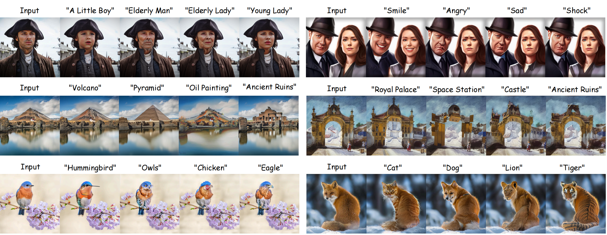
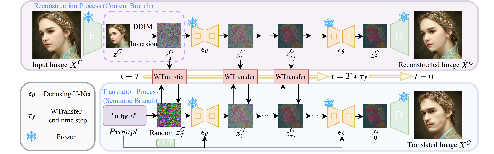

<h1 align="center"><strong>Wavelet-Guided Feature Fusion for Precise Text-Driven Image Translation </strong></h1>

<p align="center">
  Changyi Gan<sup>1</sup>,
  Xing Li<sup>1,*</sup>,
  Wenxiong Zhou<sup>1</sup>,
  Zhibo Rao<sup>1</sup>,
  Leqi Jiang<sup>1</sup>,
  Chao He<sup>1</sup>,
</p>

<p align="center">
  <sup>1</sup>School of Information Engineering, Nanchang Hangkong University &nbsp;&nbsp; <br>
  <sup>*</sup>Corresponding authors
</p>

---

<p align="center">
  
</p>

---

## 🖼️ Overview
Wavelet-Guided Feature Fusion (WGFF) is a text-driven image translation framework without training
or finetuing. You can edit the image though your prompt.

<p align="center">
  
</p>

## ⚡ Quick Start

### 1. Installation

```
conda create -n WGFF python=3.8 && conda activate WGFF

pip install torch==2.4.1 torchvision==0.19.1 torchaudio==2.4.1 --index-url https://download.pytorch.org/whl/cu124

pip install -r requirements.txt
```

### 2. Models
Download the weight from [v1.5 weight](https://huggingface.co/stable-diffusion-v1-5/stable-diffusion-v1-5/blob/main/v1-5-pruned-emaonly.ckpt)  
Put the `v1-5-pruned-emaonly.ckpt` under the folder `models`

### 3. Run
```
python app.py
```